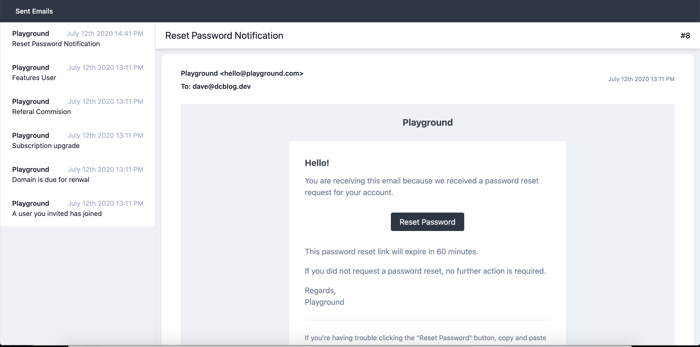

# Record and view all sent emails

[](https://packagist.org/packages/dcblogdev/laravel-sent-emails)
[](https://packagist.org/packages/dcblogdev/laravel-sent-emails)



Watch a video walkthrough https://www.youtube.com/watch?v=Oj_OF5n4l4k&feature=youtu.be

## Installation

You can install the package via composer:

```bash
composer require dcblogdev/laravel-sent-emails
```

## Migration
You can publish the migration with:

```bash
php artisan vendor:publish --provider="Dcblogdev\LaravelSentEmails\SentEmailsServiceProvider" --tag="migrations"
```

After the migration has been published you can the tables by running the migration:

```bash
php artisan migrate
```

## Config
You can publish the config with:

```bash
php artisan vendor:publish --provider="Dcblogdev\LaravelSentEmails\SentEmailsServiceProvider" --tag="config"
```

After the config has been published you can change the route path for sentemails from /sentemails to anything you like such as /admin/sentemails:

```php
'routepath' => 'sentemails'
```

## Views
You can publish the view with:

```bash
php artisan vendor:publish --provider="Dcblogdev\LaravelSentEmails\SentEmailsServiceProvider" --tag="views"
```

The views will be published to resources/views/vendor/sentemails

You can change the views to match your theme if desired.

## Usage

As soon as a email is sent it will be added to a database table and will be viewable in /sentemails.

> Note the you have to be logged in to be able to see sentemails, if you are not logged in when you attempt to see sentemails you will be redirected to a login route.

### Changelog

Please see [CHANGELOG](CHANGELOG.md) for more information what has changed recently.

## Contributing

Please see [CONTRIBUTING](CONTRIBUTING.md) for details.

### Security

If you discover any security related issues, please email dave@dcblog.dev instead of using the issue tracker.

## Credits

- [David Carr](https://github.com/dcblogdev)
- [All Contributors](../../contributors)

## License

The MIT License (MIT). Please see [License File](LICENSE.md) for more information.
